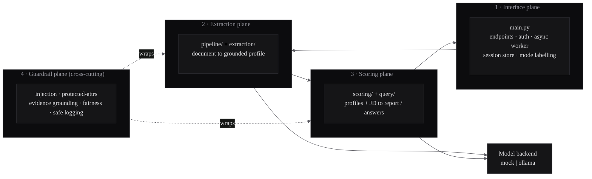
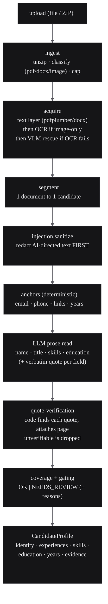
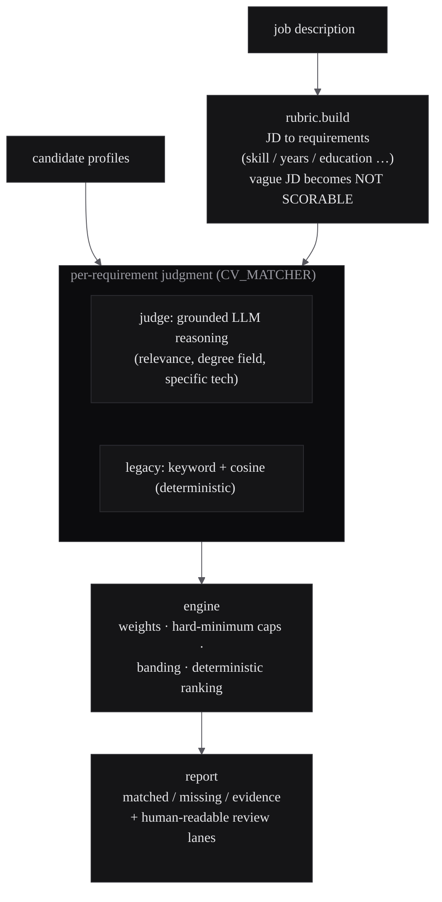
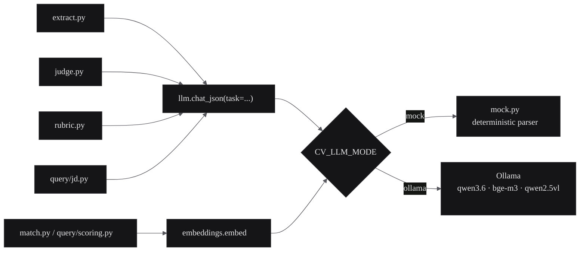

# Architecture

This document describes the system's planes, the responsibility of each module,
and — most importantly — the **trust boundaries** that separate what the model
produces from what the code guarantees.

The organising principle throughout is:

> **The LLM points; the code reads.** The model is used only for language
> understanding. Anything that must be *true* is computed deterministically and
> can overrule the model.

---

## The four planes

### 1. Interface plane — `app/main.py`, `app/config.py`, `app/session_store.py`

The only plane that speaks HTTP. It owns:

- **Endpoints & auth.** Eight routes (see [api.md](api.md)); every data route
  requires `X-API-Key`. Analysis gaps are returned as `200` results with a
  *Needs Review* reason, not HTTP errors — only genuine infra/input failures use
  4xx/5xx, so a client's error handling never masks a safe "review this" outcome.
- **The async worker.** `analyze` returns `202` immediately and runs the batch on
  a background thread pool, so a 25–200 CV upload never blocks the request; the
  client polls `status`.
- **The ephemeral session store.** Keyed by a client-supplied `chat_id`, holding
  the analysed profiles and evolving view-state with a sliding TTL. Ready sessions
  can be persisted atomically to a local volume so a restart doesn't lose a batch
  mid-conversation; expiry (and `reset`) erase both memory and disk.
- **Configuration.** Every knob is an environment variable (`CV_*`) read at call
  time, so the package is portable and the tests can flip behaviour per-case.

### 2. Extraction plane — `app/pipeline/`, `app/extraction/`

Turns an untrusted document into a **grounded candidate profile**. One file is
always one candidate's worth of pages — extraction never mixes candidates.

Key modules:

| Module | Responsibility |
|---|---|
| `pipeline/ingest.py` | Expand ZIPs, classify each file (`pdf` / `docx` / `image`), enforce count/size/entry caps. |
| `pipeline/acquire.py` | Get text: native text layer first; **OCR** (Tesseract, ara+eng) only for image-only pages; optional **VLM** transcription for pages OCR still can't read. |
| `extraction/pdf_text.py`, `ocr.py`, `image_only.py`, `pdf_render.py`, `vlm.py` | The acquisition primitives (text, OCR, scanned-page detection, page rasterisation via **pypdfium2**, local vision transcription). |
| `pipeline/segment.py` | Map documents to candidates; flag a file that appears to hold more than one CV. |
| `pipeline/anchors.py` | **Deterministic** extraction of email/phone/links and the arithmetic of total years from dated roles (with overlap merging). No model involved. |
| `pipeline/extract.py` | Orchestrate a candidate: run the injection screen, the anchors, the LLM prose read, quote-verification, protected-attribute scrubbing, and confidence gating. |
| `pipeline/dedup.py` | Detect exact duplicates and same-contact-different-content conflicts across the batch — while keeping two different people who share a name separate. |
| `pipeline/llm.py` | The single JSON chat entry point (`chat_json`) and `ping`; dispatches to the mock or Ollama backend. |

### 3. Scoring plane — `app/scoring/`, `app/query/`

Consumes profiles (never raw documents) and produces the ranked fit report and
conversational answers.

| Module | Responsibility |
|---|---|
| `scoring/rubric.py` | The **only** LLM step in scoring: the JD to a structured rubric (requirements + keywords + hard minimums); deterministic post-validation cleans and bounds it. A JD with no extractable requirements is flagged *not scorable* rather than scored with fabricated precision. |
| `scoring/judge.py` | The grounded-reasoning judge: for each requirement it returns a verdict + a cited quote; code then **grounds** the quote (must occur in the CV) — an ungrounded "met" collapses to *unverified*. Arithmetic stays in code. |
| `scoring/match.py` | The legacy deterministic matcher (keyword + embedding cosine) — the mock/fallback path, selected by `CV_MATCHER=legacy` and used automatically for any candidate the judge fails on. |
| `scoring/engine.py` | Deterministic aggregation: verdict weights, hard-minimum caps, score banding, and tie-broken ranking. Pure code — reproducible. |
| `scoring/report.py` | Renders the bilingual fit report (matched/missing/evidence, review lanes) — the single source of truth for formatting. |
| `scoring/calibration.py` | Judge accuracy + Cohen's κ against a gold set, with a drift alarm. |
| `scoring/service.py` | Orchestrates the above, with per-`(JD, mode)` caching so a repeated JD returns byte-identical results instantly. |
| `query/*` | The multi-turn conversation layer: intent handling (count/rank/compare/exclude/shortlist), JD parsing for the chat path, reference resolution ("those two", "#3"), and markdown rendering. |

### 4. Guardrail plane — cross-cutting

Not a pipeline stage but a set of invariants enforced *inside* the other planes.
See [guardrails.md](guardrails.md). In short: injection is redacted before the
model sees the text; protected attributes are never requested and are scrubbed;
every displayed claim is quote-verified; the final score is deterministic; and
the fairness audit + safe logging sit at the interface plane.

---

## The model backend boundary

Every model call in the system funnels through exactly four functions, so the
backend is swappable with a single environment variable and **no call site
changes**:

`chat_json` carries a `task` tag (`extract` / `judge` / `rubric` / `jd`) so the
mock backend can apply the right deterministic parser. This is what makes the
whole system runnable with zero models — and what makes CI able to exercise the
complete path deterministically. See
[design-decisions.md](design-decisions.md) for why this boundary was drawn here.

---

## Data & trust flow, end to end

1. **Interface** authenticates, caps input, and hands the batch to the worker.
2. **Extraction** produces profiles in which *every surfaced fact is either
   deterministic (anchors, years) or quote-verified (model prose)*. The injection
   screen has already removed adversarial text; protected attributes were never
   requested.
3. **Scoring** turns a JD into a rubric, judges each requirement with cited
   evidence, and aggregates deterministically into a ranked report.
4. **Guardrails** ensure that at no point does an unverified model claim, an
   adversarial instruction, or a protected attribute influence the result — and
   the fairness audit lets the operator check the *outcome* for adverse impact.

The result is a report that a human reviewer, an auditor, or a regulator can
follow claim-by-claim back to the source document.
